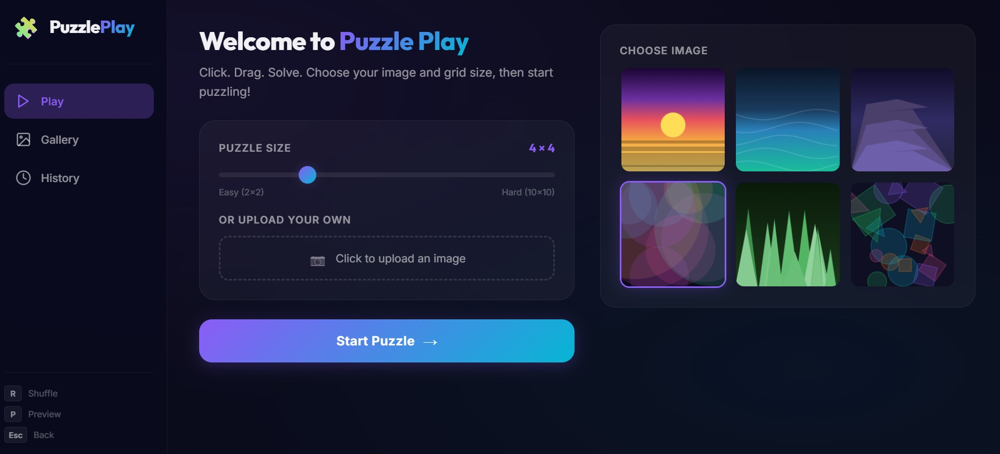
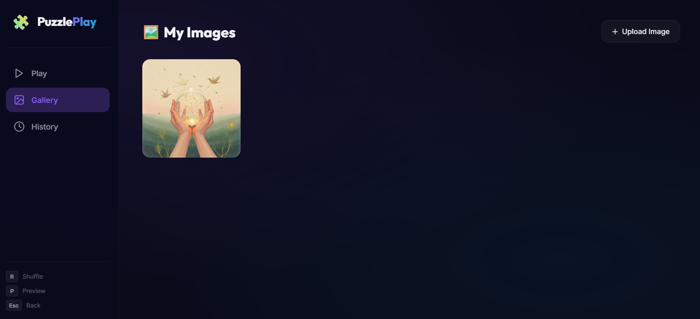
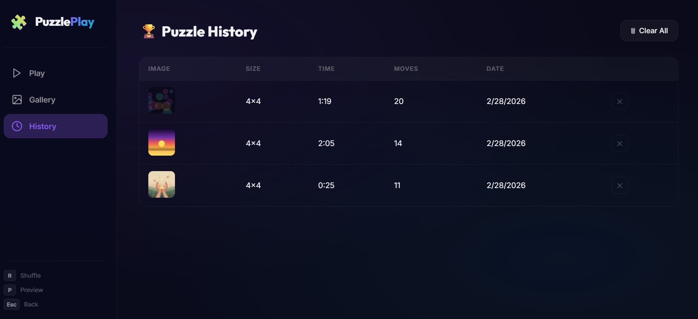

# Desktop Puzzle Play

A completely redesigned, beautiful jigsaw puzzle game built with pure HTML, CSS, and JavaScript, optimized for desktop screens with a glassmorphism theme. 🧩

## ✨ Features
- **Desktop-Optimized Layout**: Fixed left control panel and an expansive workspace for playing the puzzle on larger screens.
- **Glassmorphism Theme**: Translucent, modern UI design with `backdrop-filter: blur`, rich shadows, and vibrant accent colors.
- **Custom Puzzles**: Play with random high-quality images from Unsplash or upload your own pictures to solve.
- **Dynamic Jigsaw Shapes**: Authentic jigsaw puzzle piece shapes with interlocking tabs and blanks generated on the fly.
- **Fluid Drag-and-Drop**: Smooth, responsive mouse mechanics with piece lifting highlights.
- **Grid Resizing**: Choose a puzzle grid size from an easy 2x2 up to a challenging 10x10.
- **Keyboard Shortcuts**: Quickly `R` to shuffle, `P` to preview the original image, and `Esc` to return to the menu.
- **History & Gallery**: Automatically save your gameplay stats (moves, time taken) and your uploaded images into a local, persistent gallery.

## 📸 Screenshots

### The Main Gameplay


### Custom Image Gallery


### Puzzle History


## 🚀 How to Play
Since this is an entirely client-side web application with no build steps required, getting started is practically instant:

1. Clone or download this repository.
2. Open `index.html` in your web browser.
3. Serve it using a local development server like `npx serve` for the best local experience (to prevent local cross-origin canvas errors).

```bash
# Example
npx serve .
```

Have fun solving!
